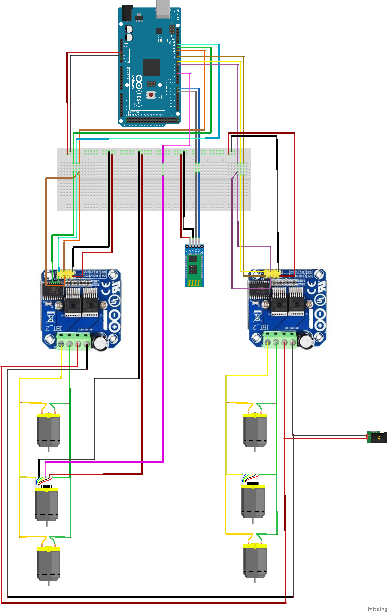

# Mars Rover Control

Firmware for Arduino Mega 2560 to control Rover and script to send commands over Bluetooth

## Hardware

* Arduino Mega 2560
* BTS7960 H-Bridge x 2
* Metal Gearmotor 25Dx54L mm HP 6V x 6
* Bluetooth HC-06
* Breadboard
* Wires



## Firmware

Using [PlatformIO](https://platformio.org/) in `firmware` folder:

```
platformio run -t upload
```

